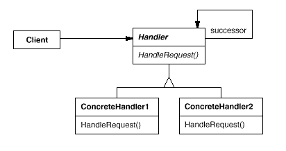

# Chain Of responsability

Usefull Links :
- https://www.baeldung.com/chain-of-responsibility-pattern
- https://refactoring.guru/design-patterns/chain-of-responsibility/java/example

## Definition

<b>Chain of Responsibility</b> is behavioral design pattern that allows passing request along the chain of potential 
handlers until one of them handles request.
The pattern allows multiple objects to handle the request without coupling sender class to the concrete classes of the 
receivers. The chain can be composed dynamically at runtime with any handler that follows a standard handler interface.

## Diagram



## Design 
- Chain of receiver objects
- Handler is Interface based
- ConcreteHandler for each implementation
- Each Handler has a reference to the next Handler, ConcreteHandler

## Usage in JDK
- javax.servlet.Filter#doFilter()
- java.util.logging.Logger#log()

```
public class ChainOfResponsibilityEverydayDemo {

	private static final Logger logger = Logger.getLogger(ChainOfResponsibilityEverydayDemo.class);
	
	public static void main(String args[]) {
		
		//level to log at
		logger.setLevel(Level.FINER);
		
		ConsoleHandler handler = new ConsoleHandler();
		//level to publish at
		handler.setLevel(Level.FINER);
		logger.addHandler(handler);
		
		logger.finest("Finest level of logging"); //this one won't print
		logger.finer("Finer level, but not as fine as finest");
		logger.fine("Fine, but not as fine as finer or finest");
		
	}
}

```

